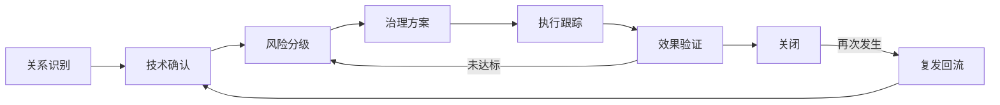

# 数智化注采管理系统

面向油田注汽与采油协同运行的业务管理平台。系统把选井、方案编制、现场施工、焖井转抽、生产跟踪与效果评价连接为可追溯的工作链路，帮助业务人员以统一数据口径掌握进度、识别偏差、沉淀经验，并持续优化下一轮运行决策。

## 业务定位

系统服务于注采一体化的日常运行、项目管理和效果分析。它以井、区块、站点和项目为业务对象，汇集计划、施工、生产、温度测试、注窜关系等数据，提供从单井研判到项目复盘的协同界面。

**完整业务闭环：**

> 选井决策 → 方案与计划 → 施工监控 → 焖井转抽 → 生产响应 → 效果评价 → 优化复盘

每个环节既可独立查看，也可关联前后业务记录：以选井依据支持方案制定，以计划与施工状态推动节点执行，以焖井和转抽后的生产数据评价措施效果，再将结论反馈到后续选井与运行优化。

## 业务模块

| 模块 | 业务价值 |
| --- | --- |
| 系统概览 | 汇总关键指标、待办事项与业务入口，快速了解整体运行态势。 |
| 注采驾驶舱 | 从井、区块、站点等维度查看注采运行指标、趋势与下钻信息。 |
| 注采状态地图 | 在地图上呈现井位、注采状态与注窜关系图层，辅助空间化研判和现场协同。 |
| 选井决策 | 维护候选井资料、评分结果与测温等依据，形成可追溯的选井建议。 |
| 方案与计划 | 管理注汽项目、月度计划、计划状态及计划—实际对比。 |
| 施工监控 | 跟踪项目节点、状态流转和待处理事项，支持施工过程协调。 |
| 焖井转抽 | 记录项目阶段转换与节点进度，衔接施工结束后的转抽管理。 |
| 生产响应 | 观察单井及区块生产变化、趋势和关键影响因素。 |
| 效果评价 | 基于计划、实际和生产响应进行措施效果分析，为复盘提供依据。 |
| 注汽优化预测 | 对注汽运行情景进行预测与比较，输出可执行的运行建议。 |
| 运行报告 | 自动汇总运行日报、周报和项目复盘所需信息，并支持导出。 |
| 注窜项目台账 | 管理注窜项目、注井—采油井关系、治理状态、效果评价及导入记录。 |
| 单井跟踪台账 | 按井查看生产指标、关联关系和治理时间线，承接项目与井对的持续跟踪。 |

## 注窜关系与治理闭环

系统采用“项目—关系—单井”三级对象管理注窜，既支持集团注汽、组合吞吐等项目化治理，也支持不纳入大型项目的单井和井对跟踪。

| 管理层级 | 主要内容 | 解决的问题 |
| --- | --- | --- |
| 项目台账 | 区块、责任人、项目状态、治理措施、计划日期、风险等级、关闭依据和项目评价 | 管什么、谁负责、整体推进到哪一步 |
| 井间关系 | 注井→采油井、汽窜/氮气窜类型、疑似/已确认/已解除状态、层系、影响等级、置信度、来源和证据 | 哪口井影响哪口井、判断依据是什么 |
| 单井跟踪 | 井档案、生产指标、全部关联关系、治理事件、效果评价和更正记录 | 措施如何实施、生产如何响应、效果是否持续 |

管理员可手工维护关系，也可通过 Excel 批量识别和导入；导入或识别形成的疑似关系需经技术人员确认后生效。治理结束通常采用“解除关系”保留历史，删除仅用于误录或重复数据。已有跟踪或评价历史的项目、关系受删除保护，更正通过追加记录保留原值、原因、人员和时间。



关系清单中的“查看详情/跟踪记录”可进入井对详情，并继续下钻到注入井或生产井的单井台账。关系详情包含关系概览、联动指标、效果评价和跟踪记录；单井台账包含概览、生产指标、关联关系和跟踪记录。治理状态按“识别/导入→确认→风险分级→治理方案→执行跟踪→效果验证→关闭→复发回流”受控流转。

注窜关系在“注采状态地图”中形成连线需要同时满足以下条件：

1. 关系两端井号能够与地图井号匹配；
2. 注入井和生产井均已标定有效坐标；
3. 两口井已进入地图使用的基础井集和注采状态数据范围；
4. 区块、关系状态和影响等级符合当前筛选条件。

因此，只有坐标并不足以保证关系显示。早期关系若在单井档案功能建立前已经导入，还需要依据关系两端井号回填单井档案；仅存在于注窜关系、尚未进入注汽项目或措施跟踪井集的井，也需要纳入地图基础井集后才能完整连线。

## 数智化能力

- **可解释选井评分**：展示候选井评分及其业务依据，便于人工审核与沟通。
- **同类井智能匹配**：为目标井匹配可参考的相似井，辅助经验迁移与方案研判。
- **四情景产量预测**：比较不同注汽运行情景下的产量响应，为方案取舍提供量化参考。
- **Top 3 最优运行推荐**：给出优先级最高的三项运行建议，并支持记录人工调整。
- **注窜影响与治理闭环**：以项目—关系—单井三级台账维护影响研判、治理进度、生产响应、效果评价和复发回流，使问题处置可跟踪、可复盘。
- **自动日报/周报/项目复盘**：将运行数据和分析结果组织为报告内容，降低人工汇总成本。

## 使用角色与数据边界

- **游客**：仅可只读浏览系统数据与分析结果。
- **管理员**：可维护业务数据、导入文件、管理项目与相关配置。
- **本地数据模式**：默认使用本地 SQLite 数据库及导入数据运行，**不依赖生产数据库**；适合演示、验证和本地部署。

## 区块归并口径

系统当前存在 6 个区块规则来源，其中 5 个实际参与计算或筛选，1 个只显示在占产分析页面文案中。各模块规则不完全一致：

| 规则来源 | 当前使用模块 | 主要差异 |
| --- | --- | --- |
| `normalizeProductionBlockGroup` | 生产动态生成器、区块曲线、重点情况递减率 | 当前生产动态标准；严格归并 `246块L*`、`3块L*`、`3618块L*`、带层位或南北方向的 `3624块` 以及 `高21` 南北变体。 |
| `normalizeForecastBlock` | 注汽旬度预测、方案筛选、注窜过滤 | 使用更宽的前缀匹配；还单独标准化 `高18`、`高10`。 |
| `normalizeWellAnalysisBlock` | 单井分析筛选、选项和表格显示 | `3624` 使用宽前缀匹配，`高21` 的支持范围与生产动态规则不同。 |
| `normalizePumpDeepBlockName` | 检泵深度分析 | 只处理部分区块，并额外将 `高372108` 归并为 `高3`。 |
| `normalizeMeasureBlockName` | 措施分析筛选与汇总 | 仅归并 `3624` 系列，其他生产动态分组不处理。 |
| 占产分析页面文案规则 | 区块占产分析 | 文案声明 `高18(北)→246块`、`高10→3624块`、`高372108→3块`，但后端当前仍按原始区块名称分组。 |

统一目标：以 `src/lib/blockProductionGrouping.ts` 导出的 `normalizeProductionBlockGroup` 作为系统唯一的区块归并函数。模块若需要显示“未分区”或“未知区块”，应在调用统一函数后处理空字符串，而不再维护独立的区块别名规则。

按当前生产动态规则统一后，`高18(北)`、`高10`、`高372108` 不会被额外归入其他区块；`高3624(南)` 和无方向、无层位的 `3624块` 也会保持原名，除非后续先扩展统一函数并补充测试。

## 技术附录

### 技术栈

- 前端：React 19、TypeScript、Vite、Tailwind CSS、ECharts / Recharts
- 后端：Node.js、Express、TypeScript（`tsx`）
- 数据：SQLite（`sqlite`、`sqlite3`），Excel 导入导出（`xlsx`）
- 可选集成：Oracle 驱动（`oracledb`）

### 目录说明

```text
src/                 React 页面、组件与业务计算逻辑
src/components/      驾驶舱、选井、项目、注窜、报告等界面
src/lib/             数据处理、预测、推荐、导入与状态管理逻辑
server.ts            Express API 与本地数据服务
production.db        SQLite 本地业务数据
public/              静态资源（如存在）
tests/               Node 测试用例
```

### 本地启动

在项目根目录创建或更新 `.env`，设置本地端口：

```env
PORT=5001
```

随后安装依赖并启动：

```bash
npm install
npm run dev
```

启动后访问：<http://localhost:5001>

常用校验命令：

```bash
npm test
npm run lint
npm run build
```

### 生产部署要点

1. 安装与构建依赖：`npm install`，再执行 `npm run build`。
2. 配置生产环境所需的 `AUTH_TOKEN_SECRET`，用于认证令牌签名；不要将实际密钥写入仓库。
3. 准备 SQLite 主数据文件和上传目录的持久化策略，并按管理员权限导入业务数据。
4. 需要连接企业生产数据时，可按部署环境扩展 Oracle 或其他生产库连接；该扩展为可选能力，本地运行不需要生产库。
5. 使用受管进程或容器平台启动 Node 服务，并通过反向代理提供 HTTPS、日志与健康检查。

### 接口能力概览

服务以 `/api` 提供业务接口，主要覆盖：

- 登录注册、同步状态与系统概览数据；
- 注采驾驶舱、状态地图、井位与生产数据查询；
- 选井数据导入、评分重算、详情和相似井查询；
- 注汽项目计划、状态流转、计划实际对比与待办查询；
- 注汽情景预测、运行推荐、调整记录、运行报告与 Excel 导出；
- 注窜项目、井间关系、导入预览与确认、项目/关系效果评价；
- 注窜单井档案、生产指标、关联关系、关系详情与治理时间线；
- 措施、占井、外输、泵况和水质等辅助业务数据的查询或导入。

### 当前限制

- 默认数据源为本地 SQLite 和人工导入文件，数据完整性与时效性取决于维护频率。
- Oracle/生产库连接不是默认运行条件，需要按企业网络、账号权限和数据模型另行实施。
- 预测、推荐和评分用于辅助决策，仍应结合现场工况与专业审核后执行。
- 本地开发服务默认面向单机使用；生产环境需自行补充访问控制、备份、监控和高可用设计。
