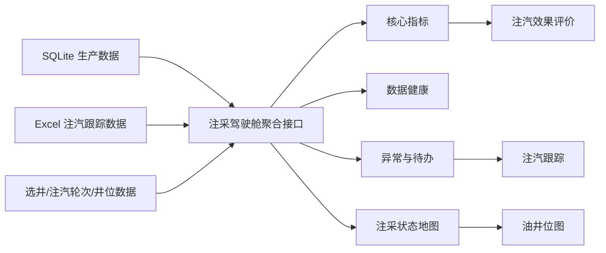

# 注采一体化驾驶舱一期设计

## 目标

在不新增 Oracle 自动同步、实时注汽施工数据或锅炉数据源的前提下，基于现有 SQLite 与 Excel 导入数据，为“数智化注采管理系统”新增一个统一的注采驾驶舱。驾驶舱让管理人员快速识别注汽项目进度、生产响应、数据质量与需要处置的井，并能下钻到现有的注汽选井、注汽跟踪、注汽效果评价和油井位图页面。

## 范围

### 本期包含

- 新增“注采驾驶舱”导航入口与页面。
- 汇总现有 `production`、`measure_tracking`、`measure_well_scores`、`measure_well_cycles` 和井位数据。
- 统一展示生产井、正注井、焖井、转抽井、日产油、累计增油、油汽比等可由现有字段计算的指标。
- 展示数据新鲜度、导入批次、缺失/未评价数据和同步异常，消除“系统运行正常”与“同步失败”并存的歧义。
- 在现有油井位图中叠加注汽项目状态：正注、焖井、转抽生产、低效/待关注、数据待补全。
- 生成可点击的异常与待办清单，并链接至相应的注汽跟踪或油井位图记录。

### 本期不包含

- 注汽施工或锅炉实时数据采集。
- 单位 Oracle 自动同步及其调度、重试和凭证管理。
- 新的方案审批、施工审批或移动端作业填报流程。
- 基于模型的选井预测或经济优化。

## 用户与使用场景

- **管理人员**：进入驾驶舱后判断本区块当前注汽项目规模、生产响应和风险井，进入待办列表安排处置。
- **技术人员**：按区块和状态定位井，检查数据缺失、转抽/焖井逾期、效果偏低等问题，再进入跟踪或评价页面分析。
- **数据维护人员**：通过数据健康卡确认生产/注汽数据更新时间、Excel 导入批次和待补字段，处理导入质量问题。

## 信息架构

新增一级入口“注采驾驶舱”，保留当前“注汽项目”下的“注汽选井、注汽跟踪、注汽效果评价”。驾驶舱不是替代页面，而是四个现有页面的统一总览与下钻入口。

## 数据口径

### 主键与时间

- 井号统一使用现有 `jh` / `well_name` 文本值；聚合前统一去空格并保留原始显示名称。
- 生产最新日期取 `production.rq` 的最大值。
- 注汽项目日期优先取 `measure_tracking.current_round_transfer_time`，为空时取 `measure_date`。
- 当前生产状态、注汽状态与评价均需保留“数据更新时间”，避免不同数据日期混用而不提示。

### 注汽生命周期状态

按 `measure_tracking.current_status` 映射，不修改原始值：

| 原始状态 | 驾驶舱状态 |
| --- | --- |
| 正注 | 正注 |
| 焖井 | 焖井 |
| 转注 | 待转抽 |
| 生产 | 转抽生产 |
| 缺失、空值或未知值 | 数据待补全 |

### 核心指标

- 生产井数：状态为“生产”的注汽跟踪记录数；同井多记录以最新转抽日期为准。
- 正注井数、焖井数、待转抽井数：按上表状态统计的最新记录数。
- 日产油：当前生产井的 `current_oil` 合计；若没有该字段则明确显示“待导入”，不以零代替。
- 累计增油：`cumulative_oil_gain` 合计；按当前评价口径显示。
- 油汽比：仅使用存在 `actual_steam` 与 `cycle_oil` 的 `measure_well_cycles` 记录，按总周期产油/总实际注汽量计算；不足数据时显示“数据待补全”。

## 页面设计

### 顶部：数据健康条

固定展示：生产数据最新日期、注汽数据最新导入日期/年份、选井数据导入日期、数据同步状态。健康状态为“正常、滞后、失败、待导入”之一，失败时展示明确原因和建议操作，不能同时显示相互矛盾的正常状态。

### 第一行：核心指标卡

按顺序展示：生产井、正注井、焖井、待转抽、日产油、累计增油、油汽比。每张卡显示数据口径和更新时间；不可计算时显示数据待补全而不是 `0`。

### 第二行：项目状态与异常待办

- 状态分布显示正注、焖井、待转抽、转抽生产、数据待补全数量。
- 待办最少包含：数据待补全、未评价、低效井、焖井逾期、待转抽逾期。
- 点击每个待办项，带着井号/状态过滤条件进入注汽跟踪；地图相关项进入油井位图。

### 第三行：注采状态地图

复用油井位图的井位坐标与现有分类能力，增加一层不可编辑的驾驶舱状态样式。图例显示状态颜色与数量；无坐标井单独显示“待补坐标”数量与井号列表。

## 接口与实现边界

- 新增只读聚合接口，例如 `GET /api/injection-production/cockpit`。
- 聚合逻辑放入独立的服务/库文件，不继续扩大 `server.ts` 中的页面业务逻辑。
- 接口返回 `dataFreshness`、`metrics`、`statusDistribution`、`alerts`、`mapWells` 五部分。
- 每个响应都必须带 `generatedAt` 和每类数据源的 `updatedAt`。
- Excel 导入接口保持兼容；本期只读取既有表，不改变导入模板。

## 异常规则

一期采用明确、可配置前仍写死在代码中的最小规则，并在界面标示规则：

- 数据待补全：状态、转抽日期、当前日产油或评价关键字段缺失。
- 未评价：生产状态且无评价等级或无上轮同期数据。
- 低效井：评价为 D 类。
- 焖井逾期：焖井状态，且转抽日期距离当前日期超过 30 天。
- 待转抽逾期：转注状态，且转抽日期距离当前日期超过 7 天。

日期不足时不产生虚假的逾期告警，而归入数据待补全。

## 权限与错误处理

- 驾驶舱沿用当前访客只读访问；不新增写入操作。
- 接口查询失败时，页面保留清晰错误提示与最后成功更新时间；不显示伪造的“系统正常”。
- 局部数据源不可用时，其他可用卡片继续展示，并标注对应数据源不可用。

## 验收标准

1. 用户可从侧边栏进入“注采驾驶舱”。
2. 页面显示生产井、正注井、焖井、待转抽、日产油、累计增油和油汽比；不可计算指标明确标记原因。
3. 页面只显示一种一致的数据健康状态，且能看见每个数据源更新时间。
4. 驾驶舱状态统计同注汽跟踪最新记录一致，不重复统计同一口井。
5. 待办可下钻至注汽跟踪或油井位图；带入的过滤条件正确。
6. 地图能以状态区分已有坐标的井，并单列无坐标井。
7. 无生产、无注汽或字段缺失时，接口和页面均不报错、不把缺失误显示为零。
8. 为聚合、状态映射、异常规则和接口响应添加自动化测试。

## 后续阶段

二期接入注汽方案、计划、施工、焖井转抽流程与项目台账；三期接入注汽施工/锅炉数据、单位 Oracle 生产数据同步、可解释选井、多维经济评价和一井一策。
